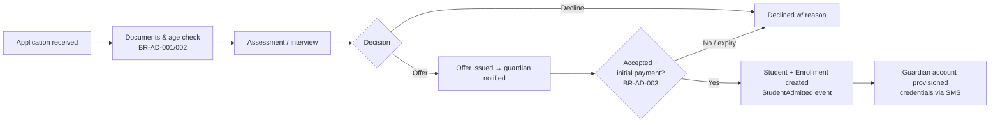
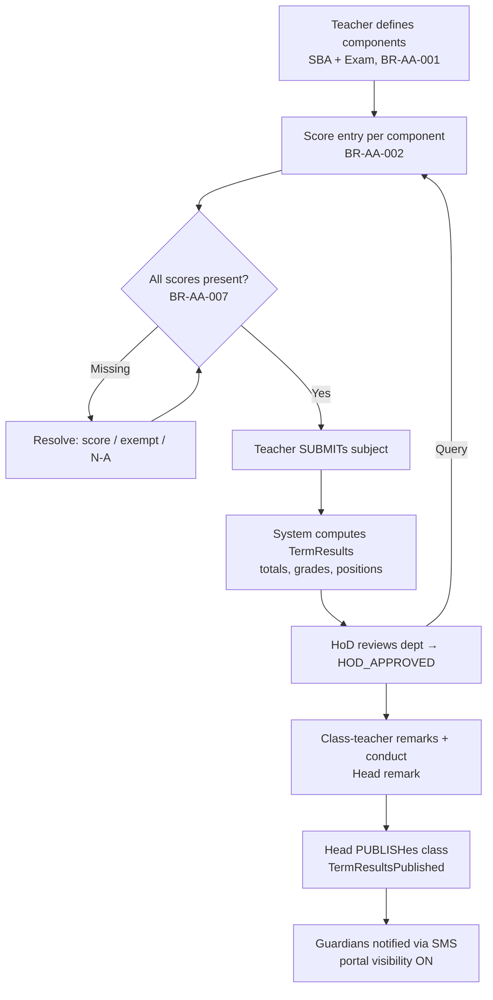

# 07 — System Workflows

> Each workflow lists trigger, actors, steps, outcomes, and edge cases. Rules cited from
> [04 — Business Rules](04-business-rules.md); events from [02 — Domain Model §4](02-domain-model.md#4-domain-events).

## WF-01 Academic Year Setup (annual, before Term 1)

**Actors:** School Admin (prepares), Head (approves), System Admin (support).

1. Create next Academic Year + three Terms with GES-aligned dates (BR-AS-001).
2. Add Term Calendar Variant for JHS 3 (BR-AS-003) and holiday calendar.
3. Confirm classes/streams and capacities; assign Class Teachers (BR-AS-005).
4. Configure subject offerings per class and assign Subject Teachers (BR-AS-006).
5. Configure Grade Scale and assessment weighting for the year (BR-AA-001/005).
6. Approve fee schedules (WF-08 precondition).
7. Activate the year (previous year must be CLOSED or closing per BR-AS-007).

**Edge cases:** teacher leaves before year start (reassign; history intact); mid-year GES calendar changes (term date edits audited, school-day calendar recalculated; attendance already taken on removed days flagged for review).

## WF-02 Admissions (POST-MVP; MVP shortcut = direct enrollment)

**Edge cases:** twins/siblings (shared guardians — link, don't duplicate); applicant to full class (BR-AD-004 override or waitlist); mid-year transfer-in (BR-AD-005 — previous school's records attached as documents, prior-term results N/A).

## WF-03 Daily Attendance

**Trigger:** each school day, per class. **Actor:** Class Teacher.

1. System presents roster from active enrollments; non-school days rejected (BR-AT-002).
2. Teacher marks statuses (BR-AT-003) in bulk; submission timestamps and locks the register (`AttendanceMarked`).
3. Same-day corrections by the teacher allowed; later corrections need elevated permission + reason (BR-AT-004).
4. (Post-MVP) Absent students' primary guardians receive same-day SMS.

**Edge cases:** student exits mid-term (enrollment status change removes them from future rosters, past records intact); whole-school closure declared after marking (day reclassified; affected records flagged, not deleted); teacher absent (HoD/School Admin may mark for the class).

## WF-04 Result Processing (per term)

**Edge cases:** correction after publication → revision + re-notify (BR-AA-006); teacher leaves mid-term (reassignment; entered scores remain attributed); student transferred out before exams (results N/A, excluded from positions); tie in class average (BR-AA-004 competition ranking).

## WF-05 Promotion (end of Term 3)

1. Precondition: Term 3 results PUBLISHED for the class (BR-PR-001).
2. System proposes PROMOTE for every active student (BR-PR-002).
3. Class Teacher/HoD flag exceptions (REPEAT) with written justification.
4. Head approves the class's decision set; guardians of repeaters are contacted before finalization.
5. Bulk-create next-year enrollments; School Admin reviews stream allocation (BR-PR-005); `StudentPromoted`/`StudentRepeated` events.

**Edge cases:** unresolved fee arrears (policy toggle BR-FI-007 — never blocks the *decision*, may block report card); student not returning (mark TRANSFERRED/WITHDRAWN instead of enrolling); level-skip request (BR-PR-003 Head approval).

## WF-06 Graduation & BECE (JHS 3, POST-MVP)

1. Term 1: candidate registration — snapshot bio-data, photos, subjects; assign index numbers (BR-BE-001/002).
2. Export WAEC registration file (FR-BEC-02); corrections tracked against the snapshot.
3. Terms 1–2: mock exam series recorded separately (BR-AA-008).
4. JHS 3 follows shortened Terms 2–3 (calendar variant).
5. After BECE: import stanine results idempotently (BR-BE-003); `BeceResultsImported`.
6. Graduation processing: status GRADUATED, leaving record/transcript data assembled (BR-PR-004); `StudentGraduated`.

**Edge cases:** candidate withdraws after registration (snapshot retained, flagged); re-sitters are out of scope (BECE re-sits happen outside basic school); results discrepancy vs WAEC print (manual correction with audit).

## WF-07 Fee Billing & Payment (per term)

**Edge cases:** overpayment (credit balance carried, applied next invoice); bounced cheque (reversal entry + rebilled); adjustment after invoicing (BR-FI-004 adjustment line, not edit); duplicate MoMo reference (idempotency check on provider reference).

## WF-08 Parent Communication

- **Automatic:** result publication, invoice issued, payment receipt, credentials, (post-MVP) absence alerts, medical-visit notifications (BR-HE-002).
- **Ad-hoc announcements:** author (per permission matrix) → audience selection (school/department/class) → outbox fan-out to guardians (BR-CO-002/003) → delivery log (BR-CO-004).
- All messages template-based; templates versioned in configuration.

**Edge cases:** guardian with multiple wards receives consolidated messages where feasible (one SMS per event type per guardian, not per ward, when content permits); invalid phone numbers surface in a delivery-failure report for School Admin follow-up.

## WF-09 Health Incident (POST-MVP)

Nurse records visit → if "notify guardian": primary contacts SMS'd (BR-HE-002) → if referral: noted (e.g. UG Hospital) → Head sees counts only (BR-HE-001/003).

## WF-10 Staff Onboarding/Offboarding

Onboard: staff record + qualifications (BR-ST-001) → account provisioned with roles → assignments (class/subject). Offboard: end date → account deactivated, future duties unassigned, history preserved (BR-ST-002).

## Data Lifecycle Summary

| Data | Created | Active use | Retention |
|---|---|---|---|
| Student records | Admission | Until exit | Permanent (alumni/transcripts) |
| Enrollments, results, attendance | Per year/term | Academic cycle | Permanent (academic history) |
| Financial records | Billing/payment | Until settled | ≥ 7 years *(assumption — align with school auditors)* |
| Health records | Nurse entry | While enrolled | Per DPA guidance; restricted archive after exit |
| Audit log | Every mutation | Investigations | ≥ 7 years, append-only |
| Notifications log | Send time | Delivery tracking | 2 years *(assumption)* |
| Applications (unsuccessful) | Application | Admission season | Purge after 2 years *(assumption, DPA minimization)* |
