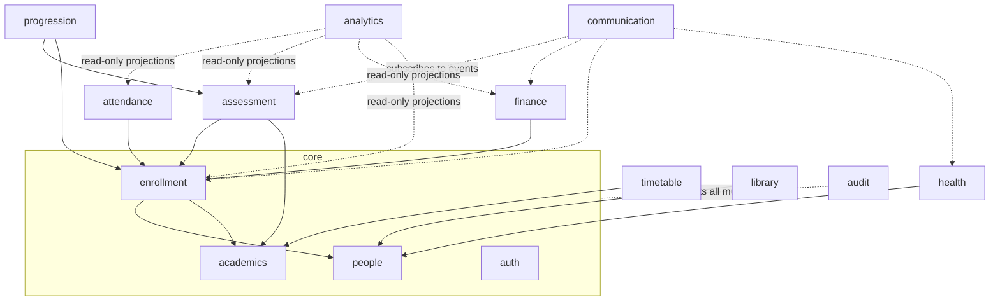

# 08 — Module Architecture

> Architecture style: **modular monolith** (ADR-001) on Spring Boot. Bounded contexts from
> [02 — Domain Model §1](02-domain-model.md#1-bounded-contexts) map to the modules below — mostly one-to-one,
> with the deliberate consolidations recorded in §6.

## 1. Package Convention (feature-module layout)

Root package `com.drakalabs.schoolmngsys`, one package per module, each internally layered:

```
com.drakalabs.schoolmngsys/
├── shared/          # cross-cutting: base types, errors (RFC 7807), events, audit hooks, pagination
├── auth/            # Identity & Access
├── academics/       # Academic Structure (years, terms, classes, subjects)
├── people/          # Students, Guardians, Staff registries
├── enrollment/      # Enrollments + (post-MVP) admissions
├── attendance/
├── assessment/      # components, scores, results, report cards, (post-MVP) mocks
├── progression/     # promotion, graduation, (post-MVP) BECE
├── finance/
├── timetable/       # post-MVP
├── lms/             # post-MVP — materials & assignments (FR-LMS-01)
├── library/         # post-MVP
├── health/          # post-MVP
├── inventory/       # post-MVP
├── communication/   # outbox, templates, announcements, providers
├── analytics/       # dashboards (read-only projections)
└── audit/
```

Inside each module (convention, not dogma — omit what a module doesn't need):

```
<module>/
├── api/         # controllers + request/response DTOs (the ONLY web-facing layer)
├── domain/      # entities, value objects, domain services, module events
├── service/     # application services (transactions, orchestration, authorization scope checks)
├── repository/  # Spring Data repositories (package-private where possible)
└── config/      # module-specific configuration
```

## 2. Boundary Rules (enforced in review; candidate for ArchUnit tests)

1. A module's `repository` and `domain` internals are **private to the module**. Other modules call its `service` interfaces or subscribe to its events — never its repositories.
2. **No web DTOs leak inward** (api → service via commands/params) and **no entities leak outward** (service → api via response DTOs).
3. `shared` depends on nothing; every module may depend on `shared`. Dependency direction between modules follows the table below; anything not listed is forbidden until documented here.
4. Cross-module *writes* happen via the owning module's service; cross-module *notifications* happen via events (in-process, transactional with the outbox for external effects).

## 3. Module Dependency Map



Key readings: `communication`, `analytics`, and `audit` are **downstream-only** — no module depends on them. `auth` is invoked via security infrastructure (filters/annotations), not direct module calls.

## 4. Module Specifications (summary)

| Module | Owns (data) | Exposes (services) | Consumes | FRs |
|---|---|---|---|---|
| auth | accounts, roles, permissions, tokens | AuthN, account provisioning, permission checks | people (person linkage) | FR-AUTH-* |
| academics | years, terms, variants, classes, subjects, offerings | calendar queries ("is date a school day for level X?"), structure queries | — | FR-ACAD-* |
| people | students, guardians, staff, links, documents | registries, guardian-ward resolution (authorization scope source) | — | FR-STU-01/02/05, FR-STF-* |
| enrollment | enrollments (+ applications post-MVP) | roster queries, enrollment lifecycle | people, academics | FR-STU-03/04, FR-ADM-*, FR-PRO-02 |
| attendance | attendance records | register capture, summaries | enrollment, academics (school days) | FR-ATT-* |
| assessment | components, scores, results, report cards, grade scales | score capture, computation, approval pipeline, report-card data | enrollment, academics | FR-RES-* |
| progression | promotion decisions, graduation, BECE candidates | promotion run, graduation, BECE registration/import | assessment, enrollment | FR-PRO-*, FR-BEC-* |
| finance | schedules, invoices, payments, adjustments | billing run, payment capture, balances, reports | enrollment (who to bill), people (billing guardians) | FR-FIN-* |
| communication | outbox, templates, announcements, delivery log | send-on-event, announce | events from all modules | FR-COM-*, FR-PAR-01 (partly) |
| analytics | materialized read models only | dashboard queries | read-only views of others | FR-DASH-* |
| audit | audit log | record + query | interception layer | FR-AUD-01 |

## 5. Folder / Repository Structure (beyond Java packages)

```
SchoolMngSys/
├── docs/                     # this documentation set (source of truth)
├── src/main/java/...         # as §1
├── src/main/resources/
│   ├── application.yml
│   └── db/migration/         # Flyway (V<seq>__<description>.sql)
├── src/test/java/...         # mirrors main packages
├── docker-compose.yml
├── CONTEXT.md                # session bootstrap + knowledge ownership registry
├── CLAUDE.md · memory.md · task.md
└── UBS-LMIS_Concept_Document.md
```

## 6. Traceability

### 6.1 Bounded context → module

Most contexts get their own module. Three are deliberately consolidated, because splitting them would create a module
whose entire content is a handful of entities sharing one lifecycle with its neighbour:

| Bounded context ([02 §1](02-domain-model.md#1-bounded-contexts)) | Module | Note |
|---|---|---|
| Identity & Access | `auth` | — |
| Academic Structure | `academics` | — |
| People | `people` | — |
| Enrollment & Admissions | `enrollment` | Admissions is post-MVP inside this module |
| Attendance | `attendance` | — |
| Assessment & Results | `assessment` | — |
| Promotion & Progression | `progression` | — |
| **BECE** | `progression` | **Consolidated**: BECE is the terminal step of a JHS 3 student's progression and shares its entities and lifecycle |
| Finance | `finance` | — |
| Timetable · Library · Health · Inventory | same-named modules | All post-MVP |
| **Staff Ops** | `people` | **Consolidated**: staff are a person type in the same registry; splitting would duplicate person handling. Revisit if HR features (leave, appraisal) grow beyond a registry |
| Communication · Audit | same-named modules | Downstream-only (§3) |
| *(no context — cross-cutting)* | `shared` | Infrastructure, not a domain |
| *(no context yet)* | `lms` | Post-MVP; scope deliberately limited to materials/assignments ([01](01-product-vision.md) out-of-scope table) |

### 6.2 Concept-document module → architecture

The [concept document](../UBS-LMIS_Concept_Document.md) lists 17 "core modules". They are product-level groupings, not
package boundaries; this table proves none was dropped.

| # | Concept module | Where it lives |
|---|---|---|
| 1 | Authentication & Roles | `auth` |
| 2 | Student Information | `people` + `enrollment` |
| 3 | Admissions | `enrollment` (post-MVP) |
| 4 | Department & Class Management | `academics` |
| 5 | Subject Management | `academics` |
| 6 | Attendance | `attendance` |
| 7 | Examination & Results | `assessment` |
| 8 | BECE Management | `progression` (post-MVP) |
| 9 | Timetable | `timetable` (post-MVP) |
| 10 | **Parent Portal** | **No module** — it is the guardian-scoped slice of `people`/`attendance`/`assessment`/`finance` plus `communication`, enforced by scope filters ([03](03-roles-and-permissions.md), [11 §3](11-security-and-privacy.md#3-authorization)). Tracked as FR-PAR-* |
| 11 | Finance & Fees | `finance` |
| 12 | Learning Management | `lms` (post-MVP, reduced scope) |
| 13 | Library | `library` (post-MVP) |
| 14 | Health Records | `health` (post-MVP) |
| 15 | Staff Management | `people` (see §6.1) |
| 16 | Inventory | `inventory` (post-MVP) |
| 17 | Dashboard & Analytics | `analytics` |

Modules with no concept-document counterpart — `shared`, `communication`, `audit`, and the promotion half of
`progression` — are infrastructure and lifecycle concerns the concept document did not name but the school's operation
requires; each is justified in its owning documentation (ADR-007 audit, ADR-008 communication, [12](12-gap-analysis.md) G-02 promotion).

## 7. Why not microservices / hexagonal-per-module? (summary; full reasoning in ADR-001)

One school, small team, strongly relational domain, heavy cross-module reads (report cards touch five contexts). A modular monolith gives transactional integrity and refactor speed now, while module boundaries + event seams keep extraction possible later. Full ports-and-adapters ceremony per module is deliberately skipped (KISS/YAGNI) — the `api/domain/service/repository` layering plus boundary rules give 80% of the benefit at 20% of the ceremony.
